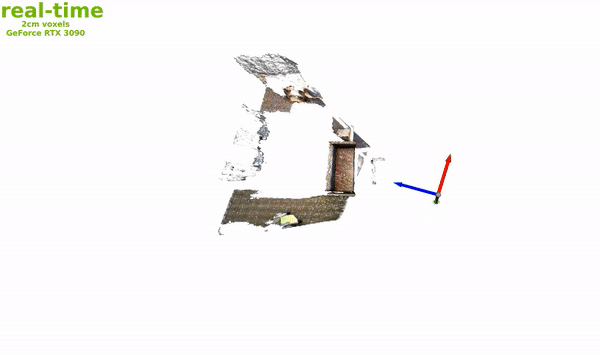
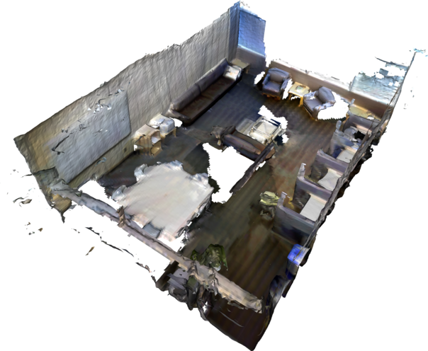

# nvblox 

Signed Distance Functions (SDFs) on NVIDIA GPUs.

<div align="center"></div>


A GPU SDF library which offers
* GPU accelerated algorithms such as:
  * TSDF construction
  * Occupancy mapping
  * ESDF construction
  * Meshing
* ROS 2 interface (see [isaac_ros_nvblox](https://github.com/NVIDIA-ISAAC-ROS/isaac_ros_nvblox))
* Support for storage of various voxel types, and easily extended to custom voxel types.

Above we show reconstruction using data from the [3DMatch dataset](https://3dmatch.cs.princeton.edu/), specifically the [Sun3D](http://sun3d.cs.princeton.edu/) `mit_76_studyroom` scene. 

## Table of Contents

- [nvblox ](#nvblox-)
  - [Table of Contents](#table-of-contents)
- [Why nvblox?](#why-nvblox)
- [How to use nvblox](#how-to-use-nvblox)
  - [Out-of-the-box Reconstruction/ROS 2 Interface](#out-of-the-box-reconstructionros-2-interface)
  - [Public Datasets](#public-datasets)
  - [C++ Interface](#c-interface)
- [Native Installation](#native-installation)
  - [Install dependencies](#install-dependencies)
  - [Build and run tests and benchmark](#build-and-run-tests-and-benchmark)
  - [Run an example](#run-an-example)
- [Docker](#docker)
- [Additional instructions for Jetson Xavier](#additional-instructions-for-jetson-xavier)
  - [Open3D on Jetson](#open3d-on-jetson)
- [Building for multiple GPU architectures](#building-for-multiple-gpu-architectures)
- [Building redistributable binaries, with static dependencies](#building-redistributable-binaries-with-static-dependencies)
- [License](#license)

# Why nvblox?

Do we need another SDF library? That depends on your use case. If you're interested in:
* **Path planning**: We provide GPU accelerated, incremental algorithms for calculating the Euclidean Signed Distance Field (ESDF) which is useful for collision checking for robotic path-planning.
* **GPU acceleration**: Our previous works [voxblox](https://github.com/ethz-asl/voxblox) and [voxgraph](https://github.com/ethz-asl/voxgraph) are used for path-planning, however utilize CPU compute only, which limits the speed of these toolboxes, and therefore the resolution of the maps they can build in real-time. nvblox is *much* faster.
* **Jetson Platform**: nvblox is written with the [NVIDIA jetson](https://www.nvidia.com/en-us/autonomous-machines/embedded-systems/) in mind. If you want to run reconstruction on an embedded GPU, you're in the right place.

Below we visualize slices through a distance function (ESDF):

<div align="center"></div>


# How to use nvblox
How use nvblox depends on what you want to do. 

## Out-of-the-box Reconstruction/ROS 2 Interface

For users who would like to use nvblox in a robotic system or connect easily to a sensor, we suggest using our [ROS 2 interface](https://github.com/NVIDIA-ISAAC-ROS/isaac_ros_nvblox).

The ROS 2 interface includes examples which allow you to:
* Build a reconstruction from a realsense camera using nvblox and NVIDIA VSLAM [here](https://github.com/NVIDIA-ISAAC-ROS/isaac_ros_nvblox/blob/main/docs/tutorial-realsense.md).
* Navigate a robot in Isaac Sim [here](https://github.com/NVIDIA-ISAAC-ROS/isaac_ros_nvblox/blob/main/docs/tutorial-isaac-sim.md).
* Combine 3D reconstruction with image segmentation with [realsense data](https://gitlab-master.nvidia.com/isaac_ros/isaac_ros_nvblox/-/blob/envoy-dev/docs/tutorial-human-reconstruction-realsense.md) and in [simulation](https://gitlab-master.nvidia.com/isaac_ros/isaac_ros_nvblox/-/blob/envoy-dev/docs/tutorial-human-reconstruction-isaac-sim.md).

The ROS 2 interface downloads and builds the library contained in this repository during installation, so you don't need to clone and build this repository at all.

## Public Datasets

If you would like to run nvblox on a public datasets, we include some executables for running reconstructions on [3DMatch](https://3dmatch.cs.princeton.edu/), [Replica](https://github.com/facebookresearch/Replica-Dataset), and [Redwood](http://redwood-data.org/indoor_lidar_rgbd/index.html) datasets. Please see our [tutorial](./docs/pages/tutorial_public_datasets.md) on running these.

## C++ Interface

If you want to build nvblox into a larger project, without ROS, or you would like to make modifications to nvblox's core reconstruction features, this repository contains the code you need. Our [tutorial](./docs/pages/tutorial_library_interface.md) provides some brief details of how to interact with the reconstruction in c++.


# Native Installation
If you want to build natively, please follow these instructions. Instructions for docker are [further below](#docker).

## Install dependencies
We depend on:
- gtest
- glog
- gflags
- SQLite 3
- CUDA 11.0 - 11.8 (others might work but are untested)
- Eigen (no need to explicitly install, a recent version is built into the library)
- stdgpu (downloaded during compilation)
Please run
```
sudo apt-get install -y libgoogle-glog-dev libgtest-dev libgflags-dev python3-dev libsqlite3-dev libbenchmark-dev
cd /usr/src/googletest && sudo cmake . && sudo cmake --build . --target install
```

## Build and run tests and benchmark
Build:
```
cd nvblox/nvblox
mkdir build
cd build
cmake .. && make
```

Run test and benchmark from build dir:
```
ctest
executables/benchmark
```

## Run an example
In this example we fuse data from the [3DMatch dataset](https://3dmatch.cs.princeton.edu/). First let's grab the dataset. Here I'm downloading it to my dataset folder `~/datasets/3dmatch`.
```
wget http://vision.princeton.edu/projects/2016/3DMatch/downloads/rgbd-datasets/sun3d-mit_76_studyroom-76-1studyroom2.zip -P ~/datasets/3dmatch
unzip ~/datasets/3dmatch/sun3d-mit_76_studyroom-76-1studyroom2.zip -d ~/datasets/3dmatch
```
Navigate to and run the `fuse_3dmatch` binary. From the nvblox base folder run
```
cd nvblox/build/executables
./fuse_3dmatch ~/datasets/3dmatch/sun3d-mit_76_studyroom-76-1studyroom2/ mesh.ply
```
Once it's done we can view the output mesh using the Open3D viewer. Instructions for installing open3d-viewer can be found below.
```
Open3D mesh.ply
```
you should see a mesh of a room:
<div align="center"></div>

# Docker

We have several dockerfiles (in the `docker` subfolder) which layer on top of one another for the following purposes:

* **Docker.deps**
* * This installs our dependencies.
* * This is used in our CI, where the later steps (building and testing) are taken care of by Jenkins (and not docker).
* **Docker.jetson_deps**
* * Same as above, just on the Jetson (Jetpack 5 and above).
* **Docker.build**
* * Layers on top of Docker.deps.
* * This builds our package.
* * This is where you get off the layer train if you wanna run stuff (and don't care if it's tested).
* **Docker.test**
* * Layers on top of Docker.build.
* * Runs ours tests.
* * Useful for checking if things are likely to pass the tests in CI.

We rely on nvidia docker. Install the [NVIDIA Container Toolkit](https://docs.nvidia.com/datacenter/cloud-native/container-toolkit/install-guide.html) following the instructions on that website.

We use the GPU during build, not only at run time. In the default configuration the GPU is only used at at runtime. One must therefore set the default runtime. Add `"default-runtime": "nvidia"` to `/etc/docker/daemon.json` such that it looks like:
```
{
    "runtimes": {
        "nvidia": {
            "path": "/usr/bin/nvidia-container-runtime",
            "runtimeArgs": []
         } 
    },
    "default-runtime": "nvidia" 
}
```
Restart docker
```
sudo systemctl restart docker
```
Now Let's build Dockerfile.deps docker image. This image install contains our dependencies.
```
docker build -t nvblox_deps -f docker/Dockerfile.deps .
```
> In case you are running this on the Jetson, substitute the dockerfile: `docker/Dockerfile.jetson_deps`

Now let's build the Dockerfile.build. This image layers on the last, and actually builds the nvblox library.
```
docker build -t nvblox -f docker/Dockerfile.build .
```
Now let's run the 3DMatch example inside the docker. Note there's some additional complexity in the `docker run` command such that we can forward X11 to the host (we're going to be view a reconstruction in a GUI). Run the container using:
```
xhost local:docker
docker run -it --net=host --env="DISPLAY" -v $HOME/.Xauthority:/root/.Xauthority:rw -v /tmp/.X11-unix:/tmp/.X11-unix:rw nvblox
```
Let's download a dataset and run the example (this is largely a repeat of "Run an example" above).
```
apt-get update
apt-get install unzip
wget http://vision.princeton.edu/projects/2016/3DMatch/downloads/rgbd-datasets/sun3d-mit_76_studyroom-76-1studyroom2.zip -P ~/datasets/3dmatch
unzip ~/datasets/3dmatch/sun3d-mit_76_studyroom-76-1studyroom2.zip -d ~/datasets/3dmatch
cd nvblox/nvblox/build/executables/
./fuse_3dmatch ~/datasets/3dmatch/sun3d-mit_76_studyroom-76-1studyroom2/ mesh.ply
```
Now let's visualize. From the same executable folder run:
```
apt-get install libgl1-mesa-glx libc++1 libc++1-10 libc++abi1-10 libglfw3 libpng16-16
wget https://github.com/isl-org/Open3D/releases/download/v0.13.0/open3d-app-0.13.0-Ubuntu_20.04.deb
dpkg -i open3d-app-0.13.0-Ubuntu_20.04.deb
Open3D mesh.ply
```
to visualize on the jetson see [below](#open3d-on-jetson).

# Additional instructions for Jetson Xavier
These instructions are for a native build on the Jetson Xavier. You can see the instructions above for running in docker.

The instructions for the native build above work, with one exception:

We build using CMake's modern CUDA integration and therefore require a more modern version of CMAKE than (currently) ships with jetpack. Luckily the Cmake developer team provide a means obtaining recent versions of CMake through apt.

1. Obtain a copy of the signing key:
```
wget -qO - https://apt.kitware.com/keys/kitware-archive-latest.asc |
    sudo apt-key add -
```
2. Add the repository to your sources list and update.
```
sudo apt-add-repository 'deb https://apt.kitware.com/ubuntu/ focal main'
sudo apt-get update
```
3. Update!
```
sudo apt-get install cmake
```
4. To use the python examples, it is also necessary to make numpy play nice with the Jetson. You can do that by adding the following to your `~/.bashrc`:
```
export OPENBLAS_CORETYPE=ARMV8
```

## Open3D on Jetson
Open3D is available pre-compiled for the jetson ([details here](http://www.open3d.org/docs/release/arm.html)). Install via pip:
```
apt-get install python3-pip
pip3 install open3d==0.16.0
```
> If version `0.16.0` is not available you need to upgrade your pip with `pip3 install -U pip`. You may additionally need to add the upgraded pip version to your path.

View the mesh via:
```
open3d draw mesh.ply
```

# Building for multiple GPU architectures
By default, the library builds ONLY for the compute capability (CC) of the machine it's being built on. To build binaries that can be used across multiple machines (i.e., pre-built binaries for CI, for example), you can use the `BUILD_FOR_ALL_ARCHS` flag and set it to true. Example:
```
cmake .. -DBUILD_FOR_ALL_ARCHS=True -DCMAKE_INSTALL_PREFIX=../install/ && make -j8 && make install
```

# Building redistributable binaries, with static dependencies
If you want to include nvblox in another CMake project, simply `find_package(nvblox)` should bring in the correct libraries and headers. However, if you want to include it in a different build system such as Bazel, you can see the instructions [here](./docs/redistributable.md).

# License
This code is under an [open-source license](LICENSE) (Apache 2.0). :)
