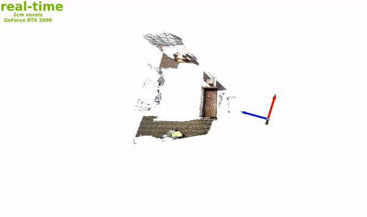

# `nvblox`

`nvblox` is a library for real-time 3D reconstruction, designed for
robotic applications.

With `nvblox` you can build, manipulate, and query reconstructions
on the GPU. The library is highly optimized for runtime performance,
taking full advantage of `CUDA` and `NVIDIA` hardware.

Depending on your use-case, you may interact with `nvblox` through
either
[Python](https://nvblox.gitlab-master-pages.nvidia.com/nvblox/),
[C++](https://nvblox.gitlab-master-pages.nvidia.com/nvblox/), or
[ROS2](https://nvidia-isaac-ros.github.io/concepts/scene_reconstruction/nvblox/index.html).

To get started with `nvblox`, see our [documentation site](https://nvblox.gitlab-master-pages.nvidia.com/nvblox/)

  
  

  
  

