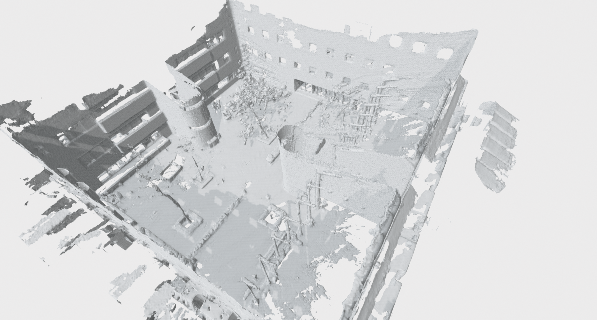
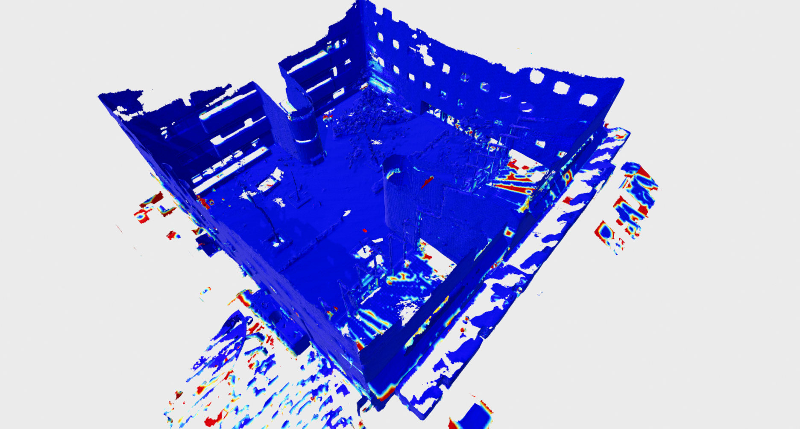

### Experimental Results

##### Reconstruction results (voxel_size = 0.1)
* Sequence: 20220216_garden_day
  * NVBlox (constant weight, truncate fused_distance): Point cloud distance [m]: 0.0713986; Coverage [%]: 0.648376
  * NVBlox (constant weight, truncate measured_distance): Point cloud distance [m]: 0.070609; Coverage [%]: 0.716344
  * NVBlox (linear weight, truncate fused_distance): Point cloud distance [m]: 0.0687769; Coverage [%]: 0.73421
  * NVBlox (exp weight, truncate fused_distance): Point cloud distance [m]: 0.0690283; Coverage [%]: 0.714388
  * VDBMapping: Point cloud distance [m]: 0.074576; Coverage [%]: 0.724301

##### Computation time (voxel_size = 0.1)
* Sequence: 20220216_garden_day
  * Normal computation with a GPU: 0.7ms per frame
  * NVBLox: 14.2ms per frame (total 2000)
  * VDBMapping: 384.062 ms per frame (total 2500)

#### Appendix

**Reconstruction results of NVBLox (voxel_size = 0.1)**

	

     
    

