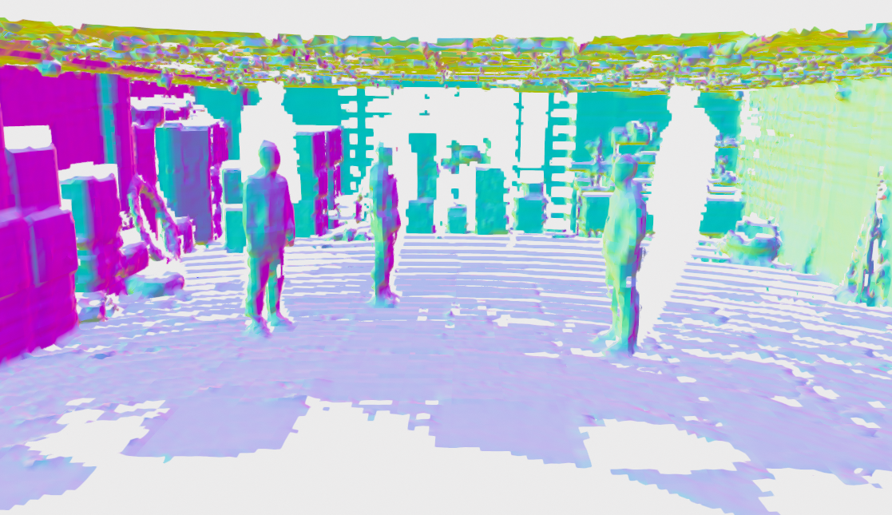
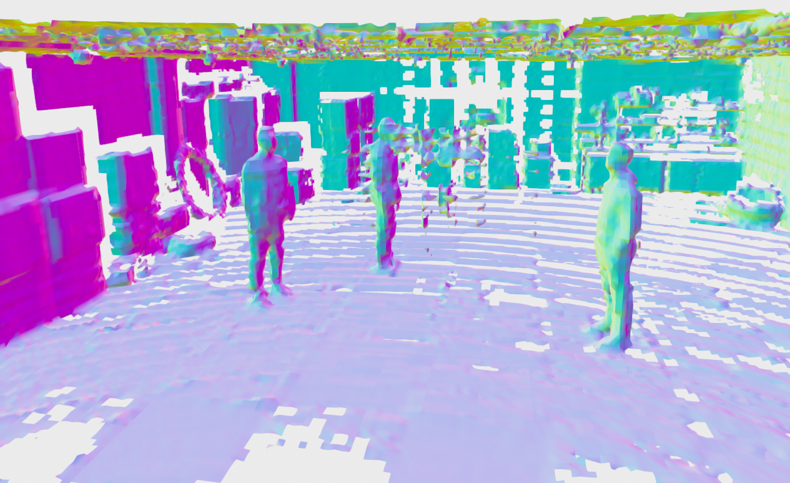
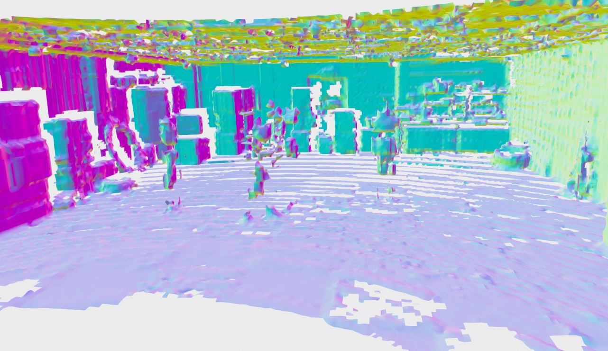

## Experiments

### Reconstruction results

###### Weight averaging methods:
```
Projective distance:
    1: constant weight, truncate the fused_distance
    2: constant weight, truncate the voxel_distance_measured
    3: linear weight, truncate the voxel_distance_measured
    4: exponential weight, truncate the voxel_distance_measured
Non-Projective distance:
    5: weight and distance derived from VoxField
    6: linear weight, distance derived from VoxField
```

###### Scene reconstruction results (voxel_size = 0.1)
| Sequence | Algorithm | Method | Point cloud distance | Coverage [%] |
| :------- | :-------- | :----- | :------------------- | :------------|
| 20220216_garden_day (2000) | NVBlox | 1 | 0.0713986  | 0.648376 |
| 20220216_garden_day (2000) | NVBlox | 2 | 0.070609   | 0.716344 |
| 20220216_garden_day (2000) | NVBlox | 3 | 0.0687769  | 0.73421  |
| 20220216_garden_day (2000) | NVBlox | 4 | 0.0690283  | 0.714388 |
| 20220216_garden_day (2000) | NVBlox | 5 | 0.0480275  | 0.388869 |
| 20220216_garden_day (2000) | NVBlox | 5 | 0.058146   | 0.631758 |
| 20220216_garden_day (2000) | NVBlox | 5 | 0.057562   | 0.651013 |
| 20220216_garden_day (2000) | NVBlox | 6 | 0.0607844  | 0.689476 |
| 20220216_garden_day (2000) | VDBMapping | 3 | 0.074576 | 0.724301 |
| 20220216_canteen_day (2600)   | NVBlox | 5 (70m)  | 0.102588  | 0.602803 |
| 20220225_building_day (2300)  | NVBlox | 5 (70m)  | 0.0704632 | 0.574235 |
| 20220216_escalator_day (3200) | NVBlox | 3             | 0.615201 | 0.649969  |
| 20220216_escalator_day (3200) | NVBlox | 5 (70m)  | 0.0526527 | 0.629851 |
| 20220216_escalator_day (3200) | NVBlox | 6 (50m)  | 0.0585957 | 0.641295 |

###### Computation time (voxel_size = 0.1)
| Sequence | Algorithm/ Module | Time per frame |
| :------- | :-------- | :----- | 
| 20220216_garden_day | Normal computation | 0.7ms |
| 20220216_garden_day | NVBLox | 14.2ms (2000) |
| 20220216_garden_day | VDBMapping | 384.062ms (2500) |
| 20220216_canteen_day | Normal computation | 0.01ms |
| 20220216_canteen_day | NVBLox | 3ms (2600) |
| 20220226_campus_road_day | NVBLox | 5ms (2000) |

###### Figures

Reconstruction of NVBLox on 20220216_garden_day (voxel_size = 0.1)
<p align="center">
	<center></center>
  <br>
  <center></center>
</p>

Reconstruction of NVBLox on 20220225_building_day (voxel_size = 0.1)
<p align="center">
	<center></center>
  <br>
  <center></center>
</p>

Reconstruction of NVBLox on other sequences (voxel_size = 0.1)
<p align="center">
	<center></center>
  <br>
  <center></center>
</p>

Obstacle information (voxel_size = 0.1)
<p align="center">
  <center></center>
</p>

Reconstruction of NVBLox on 20221126_lab_static (voxel_size = 0.05) with dynamic objcts
<p align="center">
  <center>100 frames</center>
  <br>
  <center>150 frames</center>
  <br>
  <center>600 frames</center> 
</p>