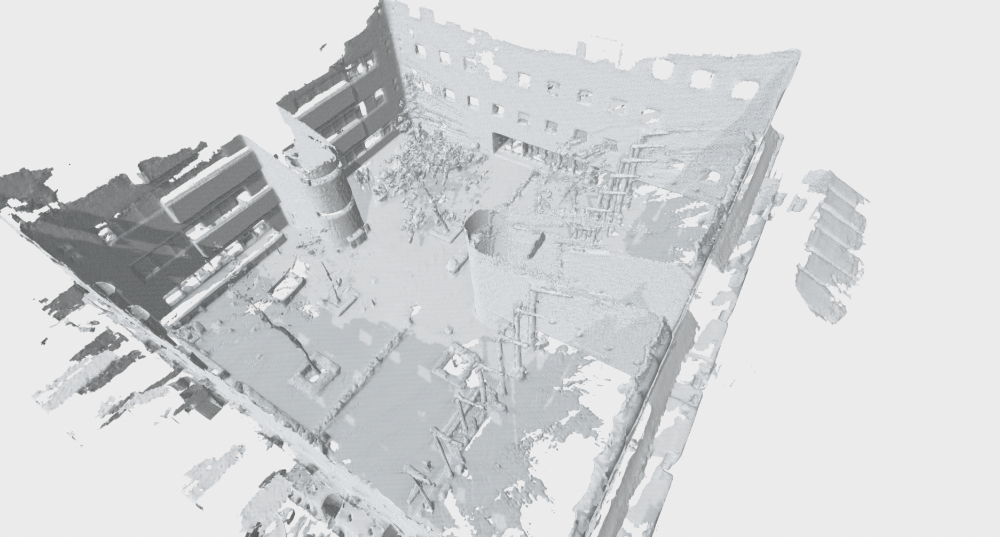

### Experimental Results

##### Reconstruction results (voxel_size = 0.1)

* Sequence: 20220216_garden_day, *2000* frames
  * Projective distance
    * NVBlox (constant weight, truncate fused_distance): 
    Point cloud distance [m]: 0.0713986; Coverage [%]: 0.648376
    * NVBlox (constant weight, truncate measured_distance): 
    Point cloud distance [m]: 0.070609; Coverage [%]: 0.716344
    * NVBlox (linear weight, truncate fused_distance): 
    Point cloud distance [m]: 0.0687769; Coverage [%]: 0.73421
    * NVBlox (exp weight, truncate fused_distance): 
    Point cloud distance [m]: 0.0690283; Coverage [%]: 0.714388

  * Non-Projective distance
    * NVBlox (non-projective distance, truncate fused_distance): (distance_th = 10.0m)
    Point cloud distance [m]: 0.0480275; Coverage [%]: 0.388869
    * NVBlox (non-projective distance, truncate fused_distance): (distance_th = 30.0m)
    Point cloud distance [m]: 0.058146; Coverage [%]: 0.631758
    * NVBlox (non-projective distance, truncate fused_distance): (distance_th = 50.0m)
    Point cloud distance [m]: 0.057562; Coverage [%]: 0.651013

  * VDBMapping: 
  Point cloud distance [m]: 0.074576; Coverage [%]: 0.724301

* Sequence: 20220216_canteen_day, *2600* frames
    * Non-Projective distance
      * NVBlox (non-projective distance, truncate fused_distance): (distance_th = 70.0m)
        Point cloud distance [m]: 0.102588; Coverage [%]: 0.602803

* Sequence: 20220225_building_day, *2300* frames
  * Non-Projective distance
    * NVBlox (non-projective distance, truncate fused_distance): (distance_th = 70.0m)
      Point cloud distance [m]: 0.0704632; Coverage [%]: 0.574235

* Sequence: 20220216_escalator_day, *3200* frames
  * Projective distance
    * NVBlox (linear weight, truncate fused_distance): 
    Point cloud distance [m]: 0.615201; Coverage [%]: 0.649969

  * Non-Projective distance
    * NVBlox (non-projective distance, truncate fused_distance): (distance_th = 70.0m)
      Point cloud distance [m]: 0.0526527; Coverage [%]: 0.629851
    * NVBlox (non-projective distance, linear weight, truncate fused_distance): (distance_th = 70.0m)
      Point cloud distance [m]: 0.0602039; Coverage [%]: 0.641247

##### Computation time (voxel_size = 0.1)
* Sequence: 20220216_garden_day
  * Normal computation with a GPU: 0.7ms per frame
  * NVBLox: 14.2ms per frame (total 2000)
  * VDBMapping: 384.062 ms per frame (total 2500)

* Sequence: 20220216_canteen_day
  * Normal computation with a GPU: 0.01ms per frame
  * NVBLox: 3ms per frame (total 2600)

* Sequence: 20220226_campus_road_day
  * NVBLox: 5ms per frame (total 2000)

#### Appendix

**Reconstruction results of NVBLox on 20220216_garden_day (voxel_size = 0.1)**

	

   
  

**Reconstruction results of NVBLox on 20220225_building_day (voxel_size = 0.1)**

	

   
  

**Reconstruction results of NVBLox on other sequences (voxel_size = 0.1)**

	

   
  

**Obstacle information (voxel_size = 0.1)**

  

