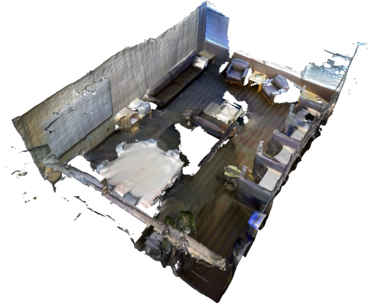

Run an Example
==============

In this example we fuse data from the `3DMatch dataset <https://3dmatch.cs.princeton.edu/>`_.

:download_test_dataset:

From the nvblox base folder run

.. code-block:: bash

    cd build/nvblox/executables
    ./fuse_3dmatch <PATH>/3dmatch/sun3d-mit_76_studyroom-76-1studyroom2/ \
      mesh.ply

This produces an output mesh file ``mesh.ply`` in the current directory.

We can view the mesh using the Open3D viewer.
First we need to install Open3D.

.. code-block:: bash

    sudo apt-get install libglib2.0-0 libgl1
    pip3 install open3d

Then visualize the mesh

.. code-block:: bash

    open3d draw mesh.ply

You should see a mesh of a room:

More examples of running nvblox on datasets are given in :doc:`core_library_more_examples`.
