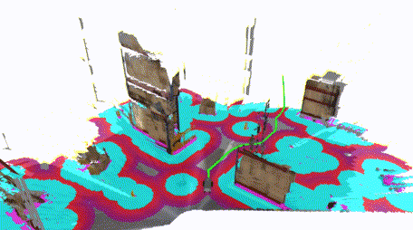

=================
ROS2 Installation
=================

If you want to use nvblox for navigation, or out-of-the-box in a robotic system the best way to do that is to use our `ROS2 wrappers <https://gitlab-master.nvidia.com/isaac_ros/isaac_ros_nvblox>`_. There's no need to install the core library if installing this way, ROS2 downloads and builds the core library before bundling it into the wrapper.

Below is an example of the nvblox being used with ROS2 Nav2 for real-time reconstruction and navigation in Isaac Sim.

.. _example navigation:

Packages in this repository
===========================

+------------------------------------+---------------+------------------------------------------------------+ 
| nvblox ROS2 package                |             Description                                              | 
+====================================+===============+======================================================+ 
| isaac_ros_nvblox                   | A meta-package. (Just a build target that builds a nvblox_ros and    |
|                                    | it's dependencies)                                                   |
+------------------------------------+---------------+------------------------------------------------------+ 
| nvblox_isaac_sim                   | Contains scripts for launching Isaac Sim configured for use with     |
|                                    | nvblox.                                                              |
+------------------------------------+---------------+------------------------------------------------------+ 
| nvblox_msgs                        | Custom messages for transmitting the output distance map slice and   |
|                                    | mesh over ROS2.                                                      |
+------------------------------------+---------------+------------------------------------------------------+ 
| nvblox_nav2                        | Contains a custom plugin that allows ROS2 Nav2 to consume nvblox     |
|                                    | distance map outputs, as well as launch files for launching a        |
|                                    | navigation solution for use in simulation.                           |
+------------------------------------+---------------+------------------------------------------------------+ 
| nvblox_ros                         | The ROS2 wrapper for the core reconstruction library and the nvblox  |
|                                    | node.                                                                |
+------------------------------------+---------------+------------------------------------------------------+ 
| nvblox_rviz_plugin                 | A plugin for displaying nvblox's (custom) mesh type in RVIZ.         |
+------------------------------------+---------------+------------------------------------------------------+ 
| [submodule] nvblox                 | The core (ROS independent) reconstruction library.                   |
+------------------------------------+---------------+------------------------------------------------------+ 

System Requirements
===================
This Isaac ROS package is designed and tested to be compatible with ROS2 Foxy on x86 and Jetson hardware.

Jetson
------
- `Jetson AGX Xavier or Xavier NX <https://www.nvidia.com/en-us/autonomous-machines/embedded-systems/>`_
- `JetPack 4.6.1 <https://developer.nvidia.com/embedded/jetpack>`_

x86_64
------
- Ubuntu 20.04+
- CUDA 11.4+ supported discrete GPU with 2+ GB of VRAM

.. note::
  If running `Isaac Sim <https://docs.omniverse.nvidia.com/app_isaacsim/app_isaacsim/requirements.html>`_, more VRAM will be required to store the simulated world.

.. note::
  For best performance on Jetson, ensure that power settings are configured appropriately (`Power Management for Jetson <https://docs.nvidia.com/jetson/l4t/index.html#page/Tegra%20Linux%20Driver%20Package%20Development%20Guide/power_management_jetson_xavier.html#wwpID0EUHA>`_).

Installation Options
====================

There are two ways to build the ROS2 interface. Either :ref:`natively <Native Installation>` or inside a :ref:`Docker container <Docker Installation>`. Note that because precompiled ROS2 Foxy packages are not available for JetPack 4.6.1 (it's based on Ubuntu 18.04 Bionic), we recommend following the docker-based instructions if building on Jetson.

Native Installation
===================

First, follow the instal the dependencies of the the core library::

  sudo apt-get install -y libgoogle-glog-dev libgtest-dev libgflags-dev python3-dev
  cd /usr/src/googletest && sudo cmake . && sudo cmake --build . --target install

Additionally, you need `CUDA <https://developer.nvidia.com/cuda-downloads>`_ version 10.2 - 11.5 installed. To make sure Linux finds CUDA on your machine, make sure something like the following is present in your `~/.bashrc`::

  export PATH=/usr/local/cuda/bin${PATH:+:${PATH}}
  export LD_LIBRARY_PATH=/usr/local/cuda/lib64:/usr/local/lib:${LD_LIBRARY_PATH:+:${LD_LIBRARY_PATH}}

Install ROS2 foxy using the `Debian instructions <https://docs.ros.org/en/foxy/Installation/Ubuntu-Install-Debians.html>`_.

.. caution::
  Sourcing ROS2 in your workspace automatically (i.e., in your ``.bashrc``) will cause Isaac Sim to break. We recommend creating an alias for sourcing your ROS2 workspace instead.

To create an alias::

  alias source_ros2="source /opt/ros/foxy/setup.bash;source ~/ros_ws/install/local_setup.bash"

Check out the nvblox repo to a path like ``~/ros_ws/src``::

  mkdir -p ~/ros_ws/src
  git clone --recurse-submodules https://github.com/NVIDIA-ISAAC-ROS/isaac_ros_nvblox

Then, build the entire workspace::

  cd ~/ros_ws/ && colcon build --symlink-install --cmake-args -DCMAKE_BUILD_TYPE=Release

Again, we recommend creating an alias for the build command::

  alias cn="sh -c 'cd ~/ros_ws/ && colcon build --symlink-install --cmake-args -DCMAKE_BUILD_TYPE=Release'"

Now that nvblox is installed you can run the :ref:`navigation example <ROS2 Example>`.

Docker Installation
===================

A docker based build can be used on both x86 and Jetson platforms. However, there is a particular impetus to consider it for building on Jetson platforms.

JetPack 4.6.1, which currently ships with Jetson, is based on Ubuntu 18.04, and nvblox requires ROS2 Foxy, which is targeted at Ubuntu 20.04. Therefore, to use nvblox on jetson you have two options:

* manually compile ROS2 Foxy and required dependent packages from source
* or use the Isaac ROS development Docker image from `Isaac ROS Common <https://github.com/NVIDIA-ISAAC-ROS/isaac_ros_common>`_.

We recommend the second option.

Nvidia Container Toolkit Setup
------------------------------

The Jetson issue aside, to use the Isaac ROS development Docker image, you must first install the `Nvidia Container Toolkit <https://docs.nvidia.com/datacenter/cloud-native/container-toolkit/install-guide.html>`__ to make use of the Docker container development/runtime environment.

Configure ``nvidia-container-runtime`` as the default runtime for Docker by editing ``/etc/docker/daemon.json`` to include the following::

    "runtimes": {
        "nvidia": {
            "path": "nvidia-container-runtime",
            "runtimeArgs": []
        }
    },
    "default-runtime": "nvidia"

Then restart Docker: ``sudo systemctl daemon-reload && sudo systemctl restart docker``

Isaac ROS Docker Setup
----------------------

Clone the ``isaac_ros_common`` repo into a folder on your system at ``~/workspaces/isaac_ros-dev/ros_ws/src``::

  mkdir -p ~/workspaces/isaac_ros-dev/ros_ws/src
  cd ~/workspaces/isaac_ros-dev/ros_ws/src
  git clone --recurse-submodules https://github.com/NVIDIA-ISAAC-ROS/isaac_ros_common.git

Clone the nvblox into ``~/workspaces/isaac_ros-dev/ros_ws/src``. This folder will be mapped by the docker container as a ROS workspace. ::

  cd ~/workspaces/isaac_ros-dev/ros_ws/src
  git clone --recurse-submodules https://gitlab-master.nvidia.com/isaac_ros/isaac_ros_nvblox.git

Start the Docker instance by running the start script::

  ~/workspaces/isaac_ros-dev/ros_ws/src/isaac_ros_common/scripts/run_dev.sh

Install the dependencies for your ROS workspace::

  cd /workspaces/isaac_ros-dev/ros_ws
  rosdep install -i -r --from-paths src --rosdistro foxy -y --skip-keys "libopencv-dev libopencv-contrib-dev libopencv-imgproc-dev python-opencv python3-opencv"

To build the code, first navigate to ``/workspaces/isaac_ros-dev/ros_ws`` inside the Docker container, then use the following command::

  colcon build --packages-up-to nvblox_nav2 nvblox_ros nvblox_msgs nvblox_rviz_plugin

The build should pass.

Now that nvblox is installed you can run the :ref:`navigation example <ROS2 Example>`.
