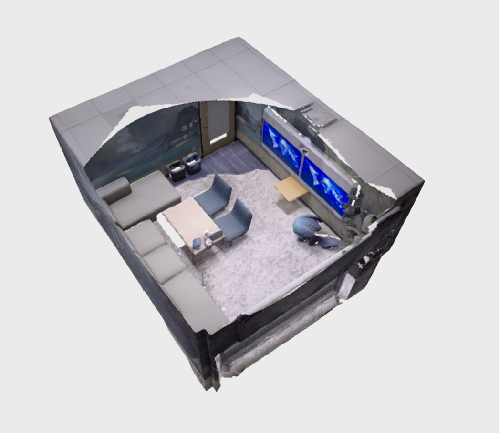
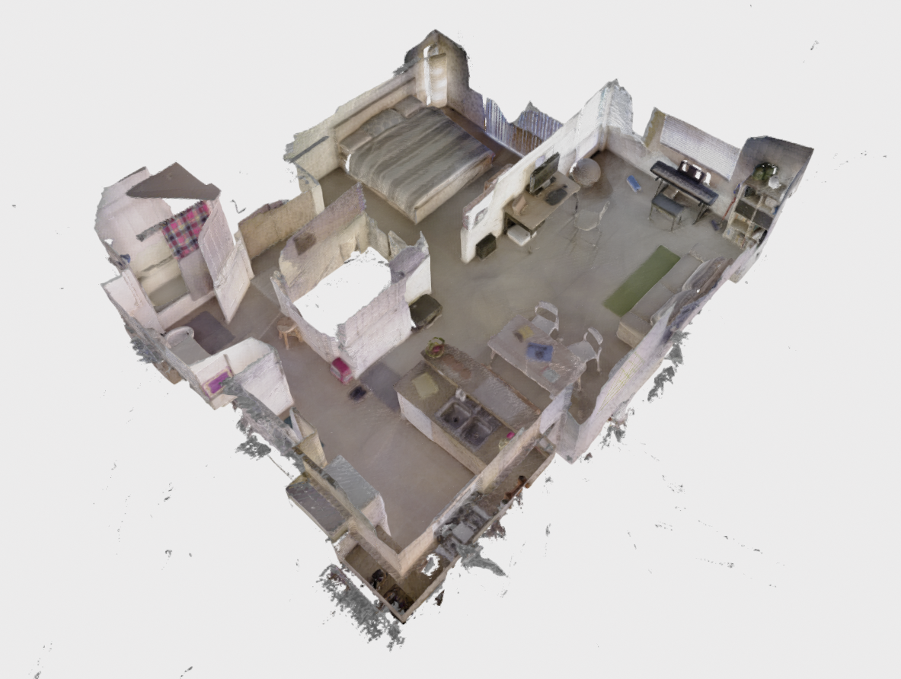

# Public Datasets Tutorial

If you would like to run nvblox on a public datasets, we include some executables for fusing [3DMatch](https://3dmatch.cs.princeton.edu/), [Replica](https://github.com/facebookresearch/Replica-Dataset), and [Redwood](http://redwood-data.org/indoor_lidar_rgbd/index.html) datasets.

The executables are run by pointing the respective binary to a folder containing the dataset. We give details for each dataset below.

## 3DMatch

Instructions to run 3DMatch are given on the front page of the README [here](https://github.com/nvidia-isaac/nvblox#run-an-example).

## Replica

We use [Replica](https://github.com/facebookresearch/Replica-Dataset) sequences from the [NICE-SLAM](https://github.com/cvg/nice-slam).

First download the dataset:

```bash
cd ~/datasets
wget https://cvg-data.inf.ethz.ch/nice-slam/data/Replica.zip
unzip Replica.zip
```

Now run nvblox and output a mesh. 

```bash
cd nvblox/build/executables
./fuse_replica ~/datasets/Replica/office0 --voxel_size=0.02 --color_frame_subsampling=20 mesh.ply
```
Note that here we specify via command line flags to run the reconstruction with 2cm voxels, and only to integrate 1 in 20 color frames.

View the reconstruction in Open3D
```bash
Open3D mesh.ply
```
<div align="center"></div>

## Redwood

The replica RGB-D datasets are available [here](http://redwood-data.org/indoor_lidar_rgbd/download.html).

Download the "RGB-D sequence" and "Our camera poses" at the link above.

Extract the data into a common folder. For example for the apartment sequence the resultant folder structure looks like:
```bash
~/datasets/redwood/apartment
~/datasets/redwood/apartment/pose_apartment/...
~/datasets/redwood/apartment/rgbd_apartment/...
```

Now we run the reconstruction
```bash
cd nvblox/build/executables
./fuse_redwood ~/datasets/redwood/apartment --voxel_size=0.02 --color_frame_subsampling=20 mesh.ply 
```
Note this dataset is large (~30000 images) so the reconstruction can take a couple of minutes.

View the reconstruction in Open3D
```bash
Open3D mesh.ply
```
<div align="center"></div>
