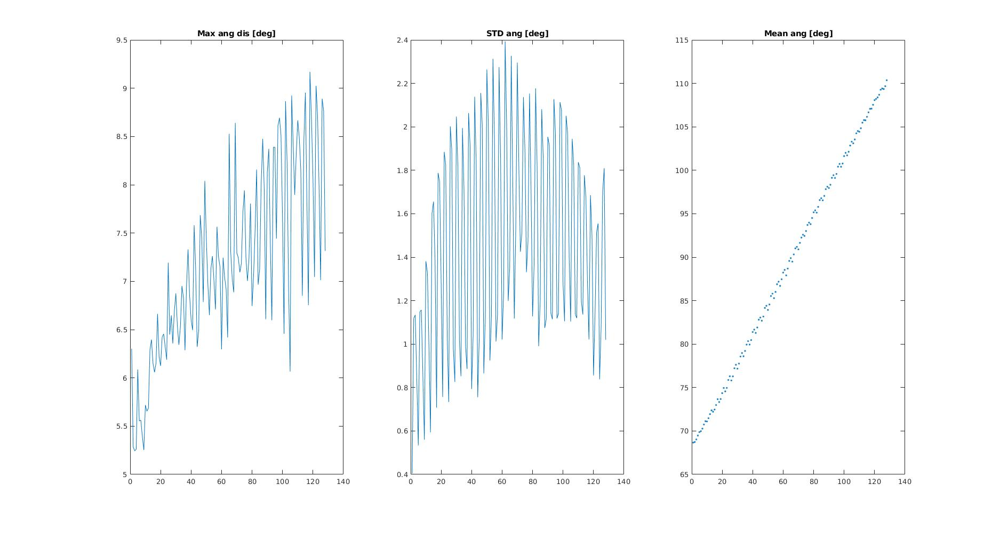
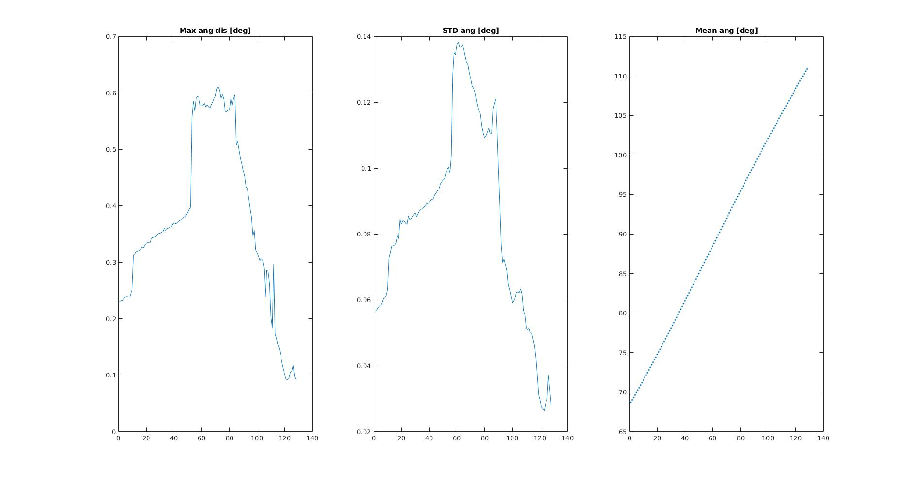

### Tricks to preprocessing OSLiDAR points

### Explanation

The perfect intrinsic model of a LiDAR should be (like VLP, Hesai):

* The elevation angle (angle between ray and +z) of each line increases evenly
* The azimuth angle of each point at one line (2pi - angle between ray and +x) increases evenly

But the intrinsics of the OSLiDAR are unstable. This means that the conversion between a point cloud and a range image is not lossless. Especially, near points may have large noise. We analyze the angle characters of OSLiDAR:

<p align="center">
	<center></center><br>
</p>


We need to preprocess the OSLiDAR points. For each line, we only keep points if their length is within <code>[scan_min, scan_max]</code>. And then we compute the mean elevation angle of the first line and last line as the starting and ending elevation angle. We analyze the angle characters of OSLiDAR with filtered points:

<p align="center">
	<center></center>
</p>
### Code to generate range images from point clouds of OSLiDAR

```c++
cv::Mat depth_img(num_elevation_divisions, num_azimuth_divisions, 
                  CV_16UC1, cv::Scalar(0));
for (const auto &pt : input_cloud) {
	float r = sqrt(pt.x * pt.x + pt.y * pt.y + pt.z * pt.z);
  	if (r <= SCAN_MIN || r >= SCAN_MAX) continue;
  	float elevation_angle_rad = acos(pt.z / r);
  	float azimuth_angle_rad = M_PI - atan2(pt.y, pt.x);
  	int row_id = round((elevation_angle_rad - start_elevation_rad) /
     	                rads_per_pixel_elevation);
  	if (row_id < 0 || row_id > num_azimuth_divisions - 1) continue;
  	int col_id = round(azimuth_angle_rad / rads_per_pixel_azimuth);
  	if (col_id >= 2048) col_id -= 2048;
  	float dep = r * default_scale_factor;
  	if (dep > std::numeric_limits<uint16_t>::max()) continue;
  	if (dep < 0.0f) continue;
  	depth_img.at<uint16_t>(row_id, col_id) = uint16_t(dep);
}
```

### Code to generate point clouds from range images for OSLiDAR

```c++
pcl::PointCloud<pcl::PointXYZ> output_cloud;
for (size_t row_id = 0; row_id < depth_img.rows; row_id++) {
    for (size_t col_id = 0; col_id < height_img.cols; col_id++) {
        float dep = depth_img.at<float>(row_id, col_id);
        float elevation_angle_rad =
            row_id * rads_per_pixel_elevation + start_elevation_rad;
        float z = height_img.at<float>(row_id, col_id);
        float r = sqrt(dep * dep - z * z);
        float azimuth_angle_rad = M_PI - float(col_id) * rads_per_pixel_azimuth;
        float x = r * cos(azimuth_angle_rad);
        float y = r * sin(azimuth_angle_rad);
        pcl::PointXYZ pt;
        pt.x = x;
        pt.y = y;
        pt.z = z;
        output_cloud.push_back(pt);
    }
}

```

