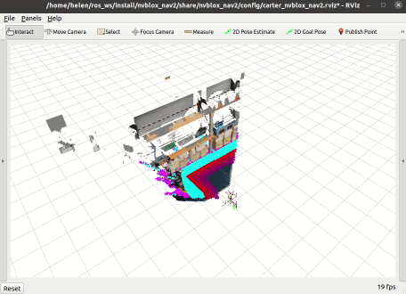

============
ROS2 Example
============

In this example, we will use nvblox to build a reconstruction from simulation data streamed from `Isaac Sim <https://developer.nvidia.com/isaac-sim>`_. Data will flow from the simulator to nvblox using ROS2 and the `isaac_ros_nvblox <https://github.com/NVIDIA-ISAAC-ROS/isaac_ros_nvblox>`_ interface.

.. _example result:
.. figure:: ../../images/nvblox_navigation_trim.gif
    :align: center

There are two ways to run nvblox in this example:

* Inside a Docker container
* In a ROS2 workspace installed directly on your machine

This example treats running docker as the default choice.

Example Description
===================

In this example, Isaac Sim will run natively on your machine and communicate with nvblox running inside a Docker container. Running in Isaac Sim is referred to as running on the *host* machine, differentiating it from running inside the *Docker*. If using the native setup, both will run on the host machine. 

Isaac Sim Setup (Host Machine)
==============================

Follow the standard instructions to install `Isaac Sim <https://docs.omniverse.nvidia.com/app_isaacsim/app_isaacsim/install_basic.html>`_
on the host machine.

As part of the set-up, make sure to install a local Nucleus server (Nucleus manages simulation assets such as maps and objects), following the instructions `here <https://docs.omniverse.nvidia.com/app_isaacsim/app_isaacsim/install_faq.html#nucleus-and-cache>`_. Mounting the Isaac share will give you access to the latest Isaac Sim samples, which these instructions use. Please also use the `latest URL for the mount <https://forums.developer.nvidia.com/t/known-issue-error-checking-isaac-sim-assets/204522>`_ (rather than what's listed in the linked tutorial)::

    Name: Isaac
    Type: Amazon S3
    Host: d28dzv1nop4bat.cloudfront.net
    Service: s3
    Redirection: https://d28dzv1nop4bat.cloudfront.net

You will launch Isaac Sim from Python scripts that automate the setup of the robot and environment. Isaac Sim uses its own python binary,
which pulls in the modules that are dependencies. To run the Isaac Sim simulation launch scripts, you will use the Isaac Sim Python binary,
which is located at ``~/.local/share/ov/pkg/{YOUR_ISAAC_SIM_VERSION}/python.sh``

For convenience, you can create an alias to this Python binary in your ``~/.bashrc``. Using the Isaac Sim version ``isaac_sim-2021.2.1-release.1``
as an example, add the following line to ``~/.bashrc``::

    alias omni_python='~/.local/share/ov/pkg/isaac_sim-2021.2.1-release.1/python.sh'

.. note::
    Ensure ``isaac_sim-2021.2.1-release.1`` is the name of the Isaac Sim version installed on your system ::

Now ``source`` the ``.bashrc`` to have access to this alias. ::

    source ~/.bashrc

Running the Simulation (on the Host) and the Reconstruction (in the Docker)
===========================================================================

For this example, you will need two terminals. In the first terminal, you will run Isaac Sim.

**Terminal 1**: Start up Isaac Sim with the correct sensors on the host machine::

    omni_python ~/workspaces/isaac_ros-dev/ros_ws/src/isaac_ros_nvblox/nvblox_isaac_sim/omniverse_scripts/carter_warehouse.py

.. note::
    Ensure there is no ROS workspace sourced in this terminal.

.. note::
    If Isaac Sim reports not finding a Nucleus server, follow the instructions `here <https://docs.omniverse.nvidia.com/app_isaacsim/app_isaacsim/install_basic.html#isaac-sim-first-run>`_ to download the required assets.

**Terminal 2:** In another terminal, start the ``isaac_ros-dev`` Docker ::

    ~/workspaces/isaac_ros-dev/scripts/run_dev.sh

Source the ``ros_ws`` ::

    source /workspaces/isaac_ros-dev/ros_ws/install/setup.bash

Run nvblox and ROS2 Nav2::

    ros2 launch nvblox_nav2 carter_sim.launch.py

You should see the robot reconstructing a mesh, with a costmap overlaid on top. To give it a command, you can select "2D Goal Pose"
in the command window at the top and select a goal in the main window. You should then see the robot plan a green path toward the
goal and navigate there, both in rviz and in simulation.

.. _example result:

