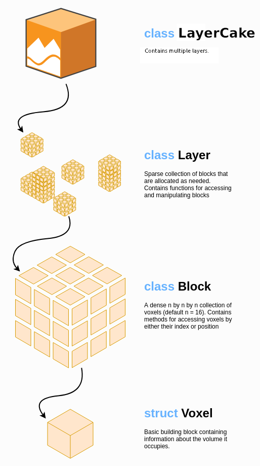

===
Map
===

We implement a hierarchical sparse voxel grid for storing data. At the top level we have the ``LayerCake``, which contains several layers, each of which contains a different type of mapped quantity (eg TSDF and ESDF). A layer is a collection of sparsely allocated blocks. Each block is in charge of mapping a cubular small region of space. Most blocks are composed of many voxels, each of which captures a single value of the mapped quantity (eg the TSDF).

The API for the various classes implementing a map nvblox map:

Voxels
======

* :ref:`TsdfVoxel <Struct TsdfVoxel>`
* :ref:`EsdfVoxel <Struct EsdfVoxel>`
* :ref:`ColorVoxel <Struct ColorVoxel>`

Blocks
======

A template for a block containing voxels.

* :ref:`VoxelBlock <Template Struct VoxelBlock>`

Blocks containing specific voxel types. These are just typedefs of the above voxel blocks.

* :ref:`TsdfBlock <Typedef nvblox::TsdfBlock>`
* :ref:`EsdfBlock <Typedef nvblox::EsdfBlock>`
* :ref:`ColorBlock <Typedef nvblox::ColorBlock>`

We store the mesh of the environment as a collection of smaller meshes. In particular, a ``MeshLayer`` contains ``MeshBlocks``, each of which contains a mesh of the surfaces in that region contained within that block. Note that we store a mesh per *block*, there are no mesh *voxels*.
Storage of the mesh in this way allows us to perform incremental updates (we only update the mesh in blocks where the underlying TSDF has changed).

* :ref:`MeshBlock <Struct MeshBlock>`

Layers
======

Template classes for layers containing blocks, and the child class for layers containing ``VoxelBlock`` s.

* :ref:`BlockLayer <Template Class BlockLayer>`
* :ref:`VoxelBlockLayer <Template Class VoxelBlockLayer>`

Typedefs for layers containing specific block types and voxel block types.

* :ref:`TsdfLayer <Typedef nvblox::TsdfLayer>`
* :ref:`EsdfLayer <Typedef nvblox::EsdfLayer>`
* :ref:`ColorLayer <Typedef nvblox::ColorLayer>`
* :ref:`MeshLayer <Typedef nvblox::MeshLayer>`

Layer Cake
==========

The ``LayerCake`` combines several layers into a single object. 

* :ref:`LayerCake <Class LayerCake>`

