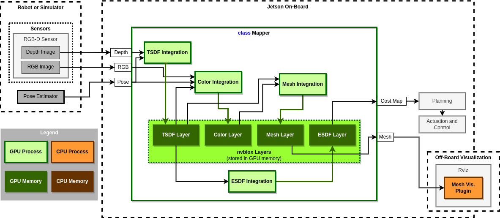

======
Mapper
======

The mapper class wraps together a number of layers (stored as a :ref:`LayerCake <Class LayerCake>`) along with integrators which operate on these layers.
Included with the nvblox core library is the :ref:`RgbdMapper <Class RgbdMapper>` which offers what we consider to be the default (but extensible) mapping behaviour in nvblox.

The structure of the :ref:`RgbdMapper <Class RgbdMapper>` and how it fits into a system is shown below:

The :ref:`RgbdMapper <Class RgbdMapper>` class contains **Layers**,

* :ref:`TsdfLayer <Typedef nvblox::TsdfLayer>`
* :ref:`ColorLayer <Typedef nvblox::ColorLayer>`
* :ref:`EsdfLayer <Typedef nvblox::EsdfLayer>`
* :ref:`MeshLayer <Typedef nvblox::MeshLayer>`

and **integrators**

* :ref:`ProjectiveTsdfIntegrator <Class ProjectiveTsdfIntegrator>`
* :ref:`ProjectiveColorIntegrator <Class ProjectiveColorIntegrator>`
* :ref:`EsdfIntegrator <Class EsdfIntegrator>`
* :ref:`MeshIntegrator <Class MeshIntegrator>`

API
===

* :ref:`MapperBase <Class MapperBase>`
* :ref:`RgbdMapper <Class RgbdMapper>`
